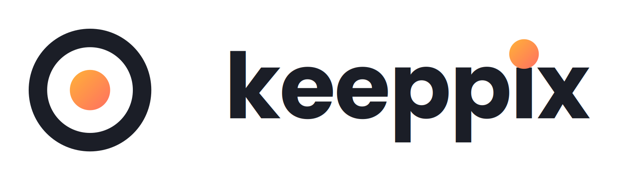

<p align="center">
  <picture>
    <source media="(prefers-color-scheme: dark)" srcset="docs/ui/logo/keeppix-lockup-dark.png">
    
  </picture>
</p>

<p align="center">
  <b>Self-hosted photo gallery for people who don't want their memories living on someone else's server.</b><br>
  RAW-aware, offline-first maps, AI that never phones home, and a hardware bar as low as a Raspberry Pi 5.
</p>

<p align="center">
  <a href="https://github.com/gmastellone/Keeppix/actions/workflows/ci.yml"></a>
  <a href="LICENSE"></a>
  
  
  
  
</p>

---

## Why Keeppix exists

Photos are the one kind of data people actually regret losing. Most self-hosted galleries either
ask for hardware most people don't have, or quietly assume you're a JPEG-only household — RAW
files get treated as an afterthought, videos need a beefy transcoding box, and "offline map" means
"still calls a tile server."

Keeppix is built the other way around: **a Raspberry Pi 5 with 8 GB of RAM is the hardware bar,
not the minimum you apologize for.** That's the floor, not the only target — the same image runs
just as well on an x86 mini-PC or a full server; if it stays smooth on a Pi, it has room to spare
everywhere else. A RAW and its JPEG sibling are one photograph, not two files competing for a spot
in your library. Maps work with the network cable pulled out. And when AI tags your photos, it
never invents a category you didn't ask for — it only ever matches against tags *you* created.

It's for the family that wants to hand their parents a URL instead of a Google Photos login, and
for the photographer who needs the RAWs to stay put, get culled fast, and be handed to a client
without leaving the building.

## What makes it different

- **A photo is a stack, not a file.** A RAW and its matching JPEG are the same shot. Keeppix
  counts, selects, rates, and deletes them as one — most galleries silently double-count RAW+JPEG
  pairs.
- **One embedding, three features, for free.** A single CLIP-style vector computed once per photo
  drives semantic search ("sunset over the harbor"), automatic tag matching, and "similar photos"
  — with near-zero extra compute per feature, and a hard guarantee the AI can never invent a tag
  you didn't create yourself: without your tag, there's no vector to match against.
- **Maps that never leave your network.** Offline tiles via PMTiles, served from the same
  container. No request to a third-party tile provider, ever — not even to check if one's needed.
- **Three honest hardware tiers, measured, not guessed.** Full / Reduced / Off for AI inference,
  chosen after actually timing an inference on *your* machine at first boot — not a hardcoded
  guess that quietly overheats a Pi.
- **One binary, no shell.** The whole backend is a single Rust process with the frontend embedded
  at compile time. The container image is distroless, non-root, and has no shell to break into.
- **A CI guard against dead code that looks alive.** Every public function and route is checked
  for a real production caller — not just a unit test. Five separate defects in this project were
  a function that was written, tested, and never actually wired to anything; this guard exists
  because of them.
- **Culling that moves real files.** Sort a card dump into keepers and rejects, and the picks are
  physically organized into `_taken` / `_skipped` subfolders — visible over WebDAV with zero WebDAV
  code, because the filesystem *is* the source of truth.

## Where it's going

The backend already speaks a versioned `/api/v1` REST API plus a WebSocket notification channel —
neither is tied to the web frontend. That's deliberate: **native mobile and desktop clients are on
the roadmap**, wrapping the same Vue frontend (Capacitor for mobile, Tauri for desktop) rather than
rewriting the UI three times.

## Features

| Capability | Status |
|---|---|
| RAW + JPEG ingest, sidecar XMP, RAW⇄JPEG stacking | ✅ shipped |
| Culling workflow, lossy derivatives, duplicate detection | ✅ shipped |
| Multi-user, permissions, albums, public share links, audit log | ✅ shipped |
| GPS extraction, reverse geocoding, offline maps (PMTiles), timezone correction | ✅ shipped |
| WebDAV, resumable (tus) upload | ✅ shipped |
| Video transcoding, encrypted backup/restore, TOTP 2FA, installable PWA | ✅ shipped |
| Semantic search, AI tag matching (CLIP embeddings, pgvector) | 🚧 planned — spec + plan written |
| Face recognition & clustering (opt-in, never on public links) | 🚧 planned — spec + plan written |
| Physical folder-based culling, safe rename-by-formula | 🚧 planned — spec + plan written |
| Redesigned interface | 🚧 planned — spec + plan written |
| Native mobile app (Capacitor) | 🗺️ roadmap |
| Native desktop app (Tauri) | 🗺️ roadmap |

## Under the hood

| Layer | Choice |
|---|---|
| Backend | Rust 1.88, Axum 0.8, sqlx 0.8 |
| Database | PostgreSQL 17 + PostGIS 3.5 (pgvector joins the same instance for AI — no second database) |
| Frontend | Vue 3, TypeScript, Vite, Tailwind v4, Reka UI |
| Media | LibRaw, `zune-jpeg`, WebP derivatives at ~0.4% of original size |
| Delivery | Single distroless, non-root, shell-less container image — built for `linux/amd64` and `linux/arm64` |
| License | AGPL-3.0-or-later, commercial licensing available (see below) |

Crates: `keeppix-domain`, `keeppix-db` (the *only* one allowed to touch SQL), `keeppix-media`
(no database access), `keeppix-api`, `keeppix-jobs`, `keeppix-server`, `keeppix-dav`,
`keeppix-test-support`.

## Quick start

Requires Docker 24+ with Compose v2.20+.

```bash
echo "DB_PASSWORD=$(openssl rand -base64 24)" > .env
docker compose --profile bundled up -d
```

Open `http://127.0.0.1:5673` and create the admin account.

Already running your own Postgres with PostGIS? Set `DATABASE_URL` and skip the `bundled`
profile. Full details, volumes, reverse proxy, upgrades: [`docs/DEPLOY.md`](docs/DEPLOY.md).

## Development

```bash
cp .env.example .env                     # DATABASE_URL → Postgres 17 + PostGIS
cd frontend && npm ci && npm run build   # rust-embed bakes dist/ in at compile time
cd .. && cargo run -p keeppix-server
```

Frontend in dev mode (proxies to `:5673`):

```bash
cd frontend && npm run dev
```

Before calling a task done:

```bash
cd frontend && npm ci && npm run build
cd .. && cargo fmt --check
cargo clippy --workspace --all-targets -- -D warnings
./scripts/test.sh
```

`./scripts/test.sh` serializes crates (`--jobs 1`), forces `--test-threads=1`, then tears down
testcontainers and `target/`. Don't run `cargo test --workspace` by hand — it spins up one
PostGIS instance per crate and will eat your RAM and disk.

## Roadmap

| Phase | Delivers | Status |
|---|---|---|
| 0 | Auth, Docker, CI, frontend scaffold | ✅ shipped |
| 1 | Libraries, ingest, timeline, search, WebSocket | ✅ shipped |
| 2 | RAW pipeline, sidecar XMP, culling, lossy derivatives | ✅ shipped |
| 3 | Multi-user, albums, public links, audit | ✅ shipped |
| 4 | Maps, geocoding, timezones, offline PMTiles | ✅ shipped |
| 5 | WebDAV, resumable upload | ✅ shipped |
| 6 | Video, backup, TOTP, installable PWA | ✅ shipped |
| **10** | **API surface for the redesigned interface** | **plan written — up next** |
| 7 | AI scenes & tags, semantic search | plan written |
| 8 | Face recognition, clustering | plan written |
| 9 | Physical culling folders, safe move, rename-by-formula | plan written |
| 11 | The redesigned interface | plan written |

Full roadmap with frozen contracts and phase dependencies:
[`docs/superpowers/plans/2026-08-13-keeppix-roadmap.md`](docs/superpowers/plans/2026-08-13-keeppix-roadmap.md).

## Documentation

| Doc | For |
|---|---|
| [`AGENTS.md`](AGENTS.md) | AI coding agents: invariants and method. Read before touching code. |
| [`docs/superpowers/PROSEGUI.md`](docs/superpowers/PROSEGUI.md) | Continuation prompt: phase order, decisions already made, where to stop and ask. |
| [`docs/superpowers/README.md`](docs/superpowers/README.md) | Index of specs, plans, ledgers. |
| [`docs/DEPLOY.md`](docs/DEPLOY.md) | Installation and operations. |
| [`docs/api/openapi.json`](docs/api/openapi.json) | The `/api/v1` HTTP contract (additive-only). |

## License

Keeppix is licensed under the **[GNU AGPL v3.0-or-later](LICENSE)**. If you self-host it, modify
it, or run it as a service, the AGPL's terms apply — including sharing your modifications with
the people you serve it to over a network.

**Commercial licensing is available** for anyone who needs different terms — embedding Keeppix in
a closed product, or running it without AGPL's network-copyleft obligations. Open an issue or
reach out via GitHub to talk about it.

Copyright © 2026 Giovanni Mastellone.
